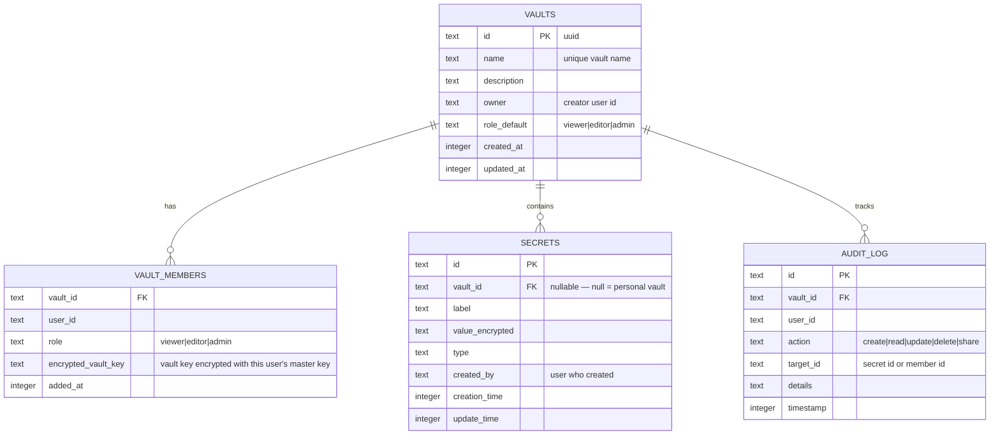

# Making pacli Usable for Teams

pacli is currently a **single-user, local-first** secrets manager — one master password, one SQLite DB per machine, Fernet encryption tied to a personal salt. This plan outlines how to evolve it into a tool teams can use to **securely share secrets** while preserving its local-first philosophy.

## User Review Required

> [!IMPORTANT]
> This is a **significant architectural change**. The plan is structured in **3 progressive phases** so you can ship value incrementally. Each phase is independently useful. Please review the scope of each phase and let me know which ones you'd like to tackle (and in what order).

> [!WARNING]
> Team features inherently introduce new attack surface (shared encryption keys, access control, network sync). The plan prioritizes security-by-design, but each phase should get a dedicated security review before release.

## Open Questions

> [!IMPORTANT]
> These decisions will shape the implementation significantly:

1. **Sync Strategy** — How should team secrets get from one machine to another?
   - **Option A: File-based sync** (encrypted `.pacli` backup files shared via Dropbox/Git/S3) — simplest, stays local-first
   - **Option B: Self-hosted server** (a `pacli server` command that runs a REST API other team members connect to) — more real-time, more infra
   - **Option C: Both** — Phase 1 uses file-based, Phase 3 adds optional server mode

2. **Team Size Target** — Are we designing for:
   - Small teams (2–10 people, flat hierarchy) → simpler RBAC
   - Larger orgs (10–50+ people, multiple teams/projects) → needs groups, namespaces

3. **Backward Compatibility** — Should existing single-user pacli installations auto-migrate, or should team mode be opt-in via `pacli team init`?

4. **Web UI Scope** — Should the Web UI support team features from day one, or should we start CLI-only and add Web UI later?

---

## Phase 1: Vaults & Team Key Sharing (Foundation)

The core primitive: **named vaults** that can each have their own encryption key, allowing secrets to be grouped and shared independently.

### Concept

```
~/.config/pacli/
├── salt.bin                    # existing — personal master
├── password_hash.bin           # existing
├── sqlite3.db                  # existing — becomes "personal" vault
└── vaults/
    ├── vault_registry.json     # maps vault names → metadata
    ├── team-infra/
    │   ├── vault.db            # SQLite for this vault's secrets
    │   ├── vault_salt.bin      # unique salt per vault
    │   └── vault_key.enc       # vault key, encrypted with member's master key
    └── team-frontend/
        ├── vault.db
        ├── vault_salt.bin
        └── vault_key.enc
```

### Data Model Changes



### Proposed Changes

---

#### [NEW] [`pacli/vault.py`](file:///Users/imshakil/GitHub/imshakil/pacli/pacli/vault.py)

Core vault management class:
- `VaultManager` — creates/lists/deletes vaults
- Per-vault Fernet key derivation (each vault has its own salt + key)
- Vault key wrapping: the vault's symmetric key is encrypted with each member's personal master key
- Member management: add/remove members, assign roles

#### [NEW] [`pacli/commands/team.py`](file:///Users/imshakil/GitHub/imshakil/pacli/pacli/commands/team.py)

New CLI command group `pacli team`:

```
pacli team init                           # Initialize team features + user identity
pacli team create-vault <name>            # Create a new shared vault
pacli team list-vaults                    # List vaults you have access to
pacli team add-member <vault> <user-id>   # Add member to vault (generates wrapped key)
pacli team remove-member <vault> <user-id>
pacli team set-role <vault> <user-id> <role>
pacli team audit-log <vault>              # View audit trail
```

#### [MODIFY] [`pacli/store.py`](file:///Users/imshakil/GitHub/imshakil/pacli/pacli/store.py)

- Add optional `vault_id` parameter to `save_secret()`, `get_secret()`, `list_secrets()`, etc.
- When `vault_id` is provided, use the vault's Fernet key instead of the personal one
- Add `created_by` field to secrets table (migration for existing data)
- Backward compatible: all existing behavior works unchanged when `vault_id=None`

#### [MODIFY] [`pacli/commands/secrets.py`](file:///Users/imshakil/GitHub/imshakil/pacli/pacli/commands/secrets.py)

- Add `--vault` / `-v` option to `add`, `get`, `list`, `update`, `delete` commands
- When `--vault` is specified, operations target that vault instead of personal store
- Example: `pacli add --vault team-infra --token aws-key`

#### [MODIFY] [`pacli/cli.py`](file:///Users/imshakil/GitHub/imshakil/pacli/pacli/cli.py)

- Register `team` command group

---

## Phase 2: Encrypted Sync & Import/Export

Build on the existing `backup export/import` to support vault-level sharing.

### Proposed Changes

---

#### [MODIFY] [`pacli/commands/backup.py`](file:///Users/imshakil/GitHub/imshakil/pacli/pacli/commands/backup.py)

Extend to support vault-scoped operations:
```
pacli backup export --vault team-infra -o team-infra.pacli
pacli backup import --vault team-infra -i team-infra.pacli
```

#### [NEW] [`pacli/commands/sync.py`](file:///Users/imshakil/GitHub/imshakil/pacli/pacli/commands/sync.py)

Optional sync commands for automated sharing:
```
pacli sync push <vault> --to <path|url>    # Push encrypted vault to shared location
pacli sync pull <vault> --from <path|url>  # Pull and merge from shared location
pacli sync auto <vault> --watch <path>     # Watch for changes and auto-sync
```

Supports:
- Local filesystem paths (Dropbox, Google Drive, NAS)
- S3-compatible storage (optional, requires `boto3`)
- Git repositories (encrypted files committed to a shared repo)

---

## Phase 3: Web UI Team Features & Optional Server Mode

### Proposed Changes

---

#### [MODIFY] [`pacli/web/app.py`](file:///Users/imshakil/GitHub/imshakil/pacli/pacli/web/app.py)

Add team-aware API endpoints:
- `GET /api/vaults` — list vaults
- `POST /api/vaults` — create vault
- `GET /api/vaults/<id>/secrets` — list secrets in vault
- `POST /api/vaults/<id>/members` — manage membership
- `GET /api/vaults/<id>/audit` — audit log

#### [MODIFY] [`pacli/web/templates/index.html`](file:///Users/imshakil/GitHub/imshakil/pacli/pacli/web/templates/index.html) + [`pacli/web/static/app.js`](file:///Users/imshakil/GitHub/imshakil/pacli/pacli/web/static/app.js)

- Vault switcher in the sidebar/header
- Team management panel (invite members, set roles)
- Audit log viewer
- Visual indicators for shared vs. personal secrets

#### [NEW] [`pacli/server.py`](file:///Users/imshakil/GitHub/imshakil/pacli/pacli/server.py) (Optional)

A lightweight relay server (`pacli server start`) that:
- Accepts encrypted vault blobs from clients
- Distributes updates to connected team members
- Zero-knowledge: server never sees decrypted secrets
- Uses WebSocket for real-time sync

---

## Security Design Principles

| Principle | Implementation |
|---|---|
| **Zero-knowledge sharing** | Vault key is wrapped per-member; shared blobs are always encrypted |
| **Least privilege** | RBAC roles (viewer/editor/admin) enforced at vault level |
| **Audit trail** | All vault operations logged with user, action, timestamp |
| **Key rotation** | Admin can rotate vault key → re-wrap for all members |
| **Backward compatible** | Personal vault works exactly as today with no team setup |
| **No plaintext on wire/disk** | Even sync files are double-encrypted (vault key + backup password) |

---

## Verification Plan

### Automated Tests

```bash
# New test files
pytest tests/test_vault.py           # Vault CRUD, key wrapping, member management
pytest tests/test_team_commands.py   # CLI team commands
pytest tests/test_vault_secrets.py   # Secrets operations within vaults
pytest tests/test_sync.py            # Sync push/pull/merge

# Existing tests should still pass
pytest tests/test_store.py
pytest tests/test_command_helpers.py
pytest tests/test_web_app.py

# Full suite with coverage
pytest --cov=pacli
```

### Manual Verification

- End-to-end: Create vault on Machine A → export → import on Machine B → verify secrets decrypt correctly
- RBAC: Verify viewer cannot modify, editor can modify, admin can manage members
- Migration: Install over existing pacli → verify personal secrets untouched
- Web UI: Vault switcher, team management, audit log (Phase 3)

---

## Recommended Execution Order

| Priority | Phase | Effort | Value |
|---|---|---|---|
| 🟢 Start here | **Phase 1** — Vaults + team key sharing | ~2-3 weeks | Foundation for all team features |
| 🟡 Next | **Phase 2** — Encrypted sync | ~1-2 weeks | Enables actual team workflows |
| 🔵 Later | **Phase 3** — Web UI + server | ~2-3 weeks | Polish and real-time experience |

Would you like to proceed with Phase 1, or do you have preferences on the open questions above?
